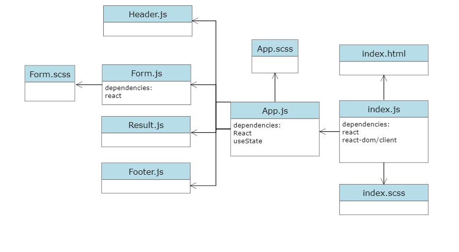

# Resty
A browser based API testing tool.

# UML

[PR](https://github.com/alsatarysamah/resty/pull/1)

# Business Requirements

Our application will be an API testing tool that can be run in any browser, allowing a user to easily interact with APIs in a familiar interface.

# Technical Requirements
The application will be created with the following overall architecture and methodologies

React

ES6 Classes

Shared Component State

Local Storage for storing request history

Superagent or Axios for performing API Requests

SASS for styling

Global Theme

Component specific CSS where possible

Test Driven Development, using Jest

Tests will be runnable locally

Deployment to GitHub Pages using an Action
